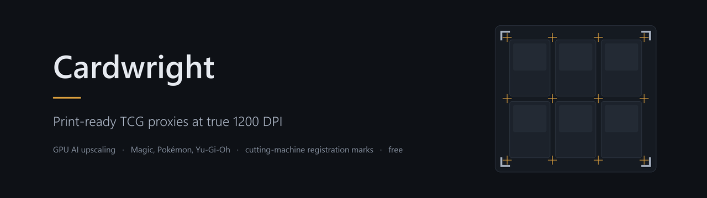

# Cardwright

**[Website](https://boffo90.github.io/cardwright/)** ·
**[Download the latest release](https://github.com/Boffo90/cardwright/releases/latest)**

Desktop app that turns Magic: The Gathering card images into **true 1200 DPI
print-ready proxies** using AI upscaling on your own GPU - free, offline
after setup, no upload limits.

Unlike web-based proxy builders (which embed ~300 DPI images into a
"1200 DPI" PDF), Cardwright reconstructs real detail with per-card AI model
selection, then builds guillotine-ready - or cutting-machine-ready - sheets
with print-shop features.

## Features

### Upscaling
- **Real AI upscaling to 2976×4160 px** (1200 DPI at 63×88 mm) on your GPU
  via Vulkan. No GPU? It falls back to high-quality resizing.
- **Automatic per-card model choice**: paper scans, digital renders and
  photorealistic art each get the model that suits them, with a manual
  override per card.
- Already high-res? The AI step is **skipped automatically** instead of
  bloating the file.
- Parallel processing, retry of failed cards, status filtering.

### Getting cards in
- Type a **card name** and a gallery opens with every printing of it,
  thumbnails and all - you see what you are about to upscale before
  committing to it.
- **Switch source** without leaving the gallery: **Scryfall**, **Gatherer**,
  **MPC Autofill**, **Pokémon** (TCGdex) and **Yu-Gi-Oh** (YGOPRODeck). MPC
  bleed edges are trimmed automatically; picking a Yu-Gi-Oh card switches the
  card size to 59×86 mm. Pokémon cards are 63×88 mm, the same as Magic.
- **Best scan** picks the sharpest printing of a searched name for you,
  keeping the same artwork - a weak scan is exactly what upscaling magnifies.
- **Card language**: fetch printings in any of the 11 languages Scryfall
  carries. Applies to name lookups and decklists; cards never printed in that
  language come back in English and are listed, rather than failing.
- Pasting a **Scryfall or Gatherer link** goes straight to the queue - you
  already chose the printing, so nothing second-guesses it. Gatherer links
  use the Gatherer image, never a substitute.
- **One exact printing, by name**: type `Sol Ring (SLD) 2560` and you get that
  art, not whichever one a bare name resolves to. Set code plus collector
  number, the way every deckbuilder writes it. A quantity in front, a lowercase
  set code and a trailing `[matte]` or `*F*` all work.
- **Decklist paste**: the same line, one card per row, so a list copied out of
  **Archidekt or Moxfield** goes in whole. Their deck URLs work too.
- **Save and load a project**: the queue itself, not just settings. A
  hand-built list with its quantities, chosen printings and per-card models
  survives closing the app. Save it after upscaling and it reopens ready to
  export, without paying for the AI again.
- **Tokens**: optionally add every token the deck's cards make - taken from
  Scryfall's own data, so it's exact.
- Import a decklist with the art coming from **Gatherer** instead of Scryfall,
  or load an **MPC Autofill order `.xml`** to get exactly the art you picked
  there.
- Local files (PNG/JPG/WEBP/AVIF/…) and drag & drop.
- Double-faced cards fetch both faces and stay paired.

### Editable print preview
The preview is a workspace, not a picture - what you see is what prints.

- Scroll through **every sheet**, not just the first.
- **Drag a card** to reorder it anywhere in the layout.
- **Right-click** a card to duplicate it, remove it from the PDF, or delete
  its file from the output folder.
- **Add cards…** to pull more in mid-export.
- Magnifier on hover to inspect detail at print resolution.
- Build a PDF straight from picked files, without using the queue.
- Print **only selected sheets** (e.g. `1` or `1-3,5`).
- **Export presets** - save and reload named configurations.

### Print sheets
- Layouts: **3×3 portrait**, **4×2 landscape**, **7-card Silhouette**, plus
  **3×4** and **4×4** for the bigger sheets - A3 and Tabloid fit 16 cards,
  and **2×1 landscape** for the 4x6 photo print.
- Games: **Magic** (Scryfall, Gatherer, MPC Autofill), **Pokémon**,
  **Yu-Gi-Oh** and **Riftbound**, all from one search box.
- Card sizes: **MTG / Pokémon (63×88)**, **Yu-Gi-Oh (59×86)**, mini (44×68),
  tarot (70×120), plus **any custom size** you enter in mm. Pokémon cards are
  the same size as Magic cards, so they work as-is.
- Pages: **A4, Letter, A3, Legal, Tabloid, A5**, and **4x6 photo** - two cards
  on a photo print, which in some countries costs a fraction of nine cards on
  A4 or Letter.
- Output as **PDF, PNG or JPEG**. Photo labs commonly refuse PDF, so the raster
  formats are there for them, at 300, 600 or 1200 DPI (4x6 at 300 DPI is
  1800×1200). PDFs are lossless or JPEG, and split into one file per N pages;
  a bitmap has no pages, so each sheet is its own file.
- Cut guides with adjustable style (cross or corner crop marks), length,
  thickness and offset; margin ticks; optional rounded corners.
- Edge bleed with selectable colour, and a **page shift on both axes, both directions** - move the whole layout off the strip your printer's feed cannot use, with the preview showing how far it will actually go.

### Cutting machines (Silhouette / Cricut)
- **Registration marks** for print & cut: 3-mark standard and 4-mark
  CAMEO 5a patterns, with adjustable inset, arm length and thickness.
- Marks follow **Silhouette Studio's own published geometry** (0.394 in inset,
  0.350 in length, 0.039 in thickness), so a sheet lands on a template built
  in Studio.
- Those marks reach onto the grid, so on a small page they cost card slots.
  **On A3 or Tabloid every layout keeps every slot** - including 4×4, sixteen
  cards a sheet - which makes them the best pairings for machine cutting.
  Legal keeps all nine in 3×3; on A4 use 4×2 (8) or the 7-card layout (7).
  If a mark would sit on a card, that slot is left empty and the card moves to
  the next sheet, and a live hint names the mark inset that would keep them
  all.
- Guides and margin ticks never print inside a mark's clear area, and turning
  guides off removes all of them.
- **7-card Silhouette layout**: one vertically centred card in the left
  column plus a 3×2 block, clearing both left corners where a Cameo's key
  marks sit (clearance goes from ~5 mm to ~49 mm on Letter).

### Duplex backs
- Mirrored back pages for flip-on-long-edge printing, DFC backs paired
  automatically, plus a user-supplied or MPC-sourced generic back.
- **Back offset and rotation** to correct duplex misalignment, and back
  bleed to survive drift.
- **Duplex alignment test**: a two-page front/back registration sheet. Print
  it double-sided, hold it to the light, dial in offset and rotation.

### Print quality
- **Calibration sheet** with 9 colour profiles to match your printer.
- **Shadow-lift test sheet** - rescues dark details crushed by inkjet plus
  matte lamination.
- **Black border deepening** for scans whose border prints as dark grey, in
  two flavours: **Contrast edges** (the default) pushes the dark pixels inside
  a fixed band at the card's edge, so nothing has to guess where the border
  is; **Auto-detect** measures the frame and snaps it to black. Both take a
  per-card override, and you choose which sources get treated at all - MPC
  art already carries a true black edge, so it is left alone by default.
- Output sharpening. All of it is applied at PDF time - your PNG masters
  stay untouched.

## Install (Windows)

1. Download the latest release from [Releases](../../releases) - the
   installer (`Cardwright_Setup-x.y.z.exe`, per-user, no admin) or the
   portable `Cardwright.exe`.
2. Run it. On first launch it downloads the AI engine and models
   (one time) from their official sources and detects your GPU.
3. The app updates itself from within.

Something misbehaving? The **Log** button in the header opens a log file with
the full details of any failure - attach it to a bug report.

### If your antivirus flags it

Windows Defender may report `Trojan:Win32/Wacatac.C!ml`. The `!ml` suffix means
a machine-learning guess about the file's shape, not a match against a known
virus, and Wacatac is Defender's catch-all for packed executables.

Cardwright is a packed executable that legitimately does three things malware
also does: it ships as one self-extracting file (PyInstaller), it downloads and
runs another executable on first launch (the Real-ESRGAN engine), and it
replaces its own `.exe` when you accept an update. All three are visible in the
source in this repository.

**Verify what you downloaded.** Every release lists the SHA-256 of both files:

```
certutil -hashfile Cardwright.exe SHA256
```

If it matches the release page, you have exactly the file that was published.
You can also build it yourself from source, below.

The real fix is a code-signing certificate, which is not yet in place. Until
then each release is reported to Microsoft as a false positive.

## Run from source

Runs on **Windows and macOS**, Python 3.10+. There is no packaged macOS build
yet, so on a Mac this is the way to run it.

**Windows**

```
pip install -r requirements.txt
python main.py
```

**macOS** - Homebrew ships the Tk bindings as a separate formula per Python
version (`python-tk@3.13` pairs with `python@3.13`), and a mismatched pair
fails with `No module named '_tkinter'`. Install a matching pair and use that
interpreter the whole way through:

```
brew install python@3.13 python-tk@3.13
python3.13 -m venv .venv
source .venv/bin/activate
pip install -r requirements.txt
python main.py
```

First launch downloads the macOS build of the AI engine and detects the GPU
exactly as it does on Windows - Apple Silicon is native, reaching the GPU
through Metal rather than Vulkan. The in-app updater stays Windows-only,
since releases only carry Windows builds.

## Licence

Cardwright is **free to use** but it is **not open source**. The code is
published so anyone can read and audit what the app does - you are welcome
to study it, build it for your own use, and send bug reports or pull
requests. You may not redistribute it, publish a modified or rebranded
version, or sell it. See [LICENSE](LICENSE).

## Legal

- This is an unofficial Fan Content project, not affiliated with or
  endorsed by Wizards of the Coast. It ships no Wizards assets; card
  images are fetched at the user's request from public APIs.
- Card data and images courtesy of [Scryfall](https://scryfall.com);
  this app is not affiliated with Scryfall.
- Yu-Gi-Oh card data and images courtesy of
  [YGOPRODeck](https://ygoprodeck.com); this app is not affiliated with them.
  Images are downloaded once to your machine rather than hotlinked, per their
  API terms.
- Pokémon card data and images courtesy of [TCGdex](https://tcgdex.dev);
  this app is not affiliated with them. Images are downloaded to your machine
  rather than hotlinked.
- AI engine: [Real-ESRGAN](https://github.com/xinntao/Real-ESRGAN)
  (BSD-3). Community models UltraSharp (Kim2091) and High Fidelity are
  fetched from the [Upscayl](https://github.com/upscayl/upscayl) project
  and carry non-commercial licenses.
- Registration-mark geometry follows the spec used by
  [silhouette-card-maker](https://github.com/Alan-Cha/silhouette-card-maker)
  (MIT); the 7-card arrangement matches the "SevenCard" template from
  [ProxySheet](https://github.com/Regenshire/ProxySheet) (GPL-3.0). No code
  from either project is used - only the published geometry.
- The contrast-edges border treatment is a reimplementation of the approach
  used by [Proxxied](https://github.com/acoreyj/proxies-at-home) (MIT). Their
  code is GLSL; this is an independent numpy implementation.
- Intended for personal playtesting. You are responsible for how you use
  the output.

## Support

Free for the community. If Cardwright saves you time, donations help keep
it maintained:

[](https://www.paypal.com/paypalme/warchazzz)
